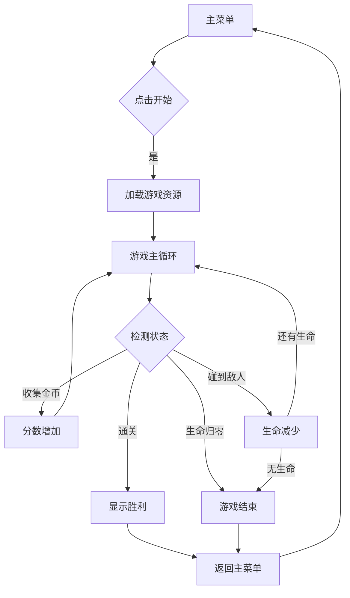

# 像素冒险游戏 - 产品需求文档

## 1. 产品概述

一款复古像素风格的2D平台冒险游戏，玩家操控角色在像素世界中探索、收集金币、躲避敌人，体验经典的8-bit游戏乐趣。

- **核心目的**：提供怀旧、轻松、充满成就感的像素游戏体验
- **目标用户**：喜欢复古游戏、像素艺术的玩家群体
- **市场价值**：唤起玩家对经典游戏的情感共鸣，适合休闲娱乐场景

## 2. 核心功能

### 2.1 用户角色
| 角色 | 操作方式 | 核心权限 |
|------|---------|---------|
| 玩家 | 键盘方向键/WASD控制移动，空格跳跃 | 控制角色移动、跳跃、收集金币 |

### 2.2 功能模块
1. **主菜单界面**：游戏标题、开始游戏按钮、操作说明
2. **游戏主界面**：玩家控制、地图渲染、敌人AI、金币收集、分数显示
3. **游戏结束界面**：显示最终得分、重新开始按钮

### 2.3 页面详情
| 页面名称 | 模块名称 | 功能描述 |
|---------|---------|---------|
| 主菜单 | 标题展示 | 像素风标题动画，开始游戏按钮 |
| 主菜单 | 操作说明 | 显示键盘控制方式 |
| 游戏界面 | 游戏画布 | Canvas渲染游戏场景 |
| 游戏界面 | HUD | 显示分数、金币数量、剩余生命 |
| 游戏界面 | 暂停菜单 | ESC暂停游戏 |
| 结束界面 | 结果展示 | 显示最终得分和重新开始选项 |

## 3. 核心流程

### 3.1 游戏主流程

### 3.2 玩家操作流程
- 移动：← → 键或 A D 键左右移动
- 跳跃：空格键或 W 键
- 暂停：ESC 键

## 4. 用户界面设计

### 4.1 设计风格
- **整体风格**：纯正8-bit像素复古风格
- **色彩方案**：
  - 主色调：深蓝 #1a1a2e（夜空）
  - 次色调：草绿 #4a7c59（草地/平台）
  - 强调色：金色 #ffd700（金币）、红色 #e74c3c（敌人/危险）
  - 角色色：蓝色 #3498db（玩家）
- **字体**：像素风格字体（Press Start 2P 或类似）
- **布局**：居中画布，顶部HUD信息栏

### 4.2 页面设计概览
| 页面 | 模块 | UI元素 |
|-----|------|-------|
| 主菜单 | 标题区 | 像素字体标题，带闪烁动画 |
| 主菜单 | 按钮区 | 像素风格按钮，hover发光效果 |
| 游戏界面 | 游戏区 | 640x480 Canvas，居中显示 |
| 游戏界面 | HUD | 左上角显示分数/金币/生命 |
| 结束界面 | 结果区 | 大号像素字体分数，闪烁重新开始 |

### 4.3 响应式设计
- 桌面优先设计
- Canvas固定尺寸，居中适配
- 最小支持宽度：800px

### 4.4 视觉效果
- **像素化滤镜**：CSS `image-rendering: pixelated`
- **扫描线效果**：可选CRT扫描线叠加
- **闪烁动画**：标题和按钮的闪烁效果
- **粒子效果**：金币收集时的像素粒子爆炸

## 5. 游戏机制

### 5.1 玩家控制
- 移动速度：5像素/帧
- 跳跃高度：12像素
- 重力加速度：0.5像素/帧²
- 碰撞检测：矩形碰撞

### 5.2 敌人行为
- 敌人类型1：巡逻敌人（左右往返移动）
- 敌人类型2：跳跃敌人（固定位置上下跳跃）
- 敌人移动速度：2像素/帧

### 5.3 收集物品
- 金币：+100分，触发收集动画
- 生命道具：+1生命（红色心形）

### 5.4 关卡设计
- 单关卡设计，横向卷轴
- 地图尺寸：1280x480像素
- 平台数量：8-10个
- 金币数量：10-15个
- 敌人数量：3-5个
- 终点：右侧城堡/旗帜

## 6. 音效设计

### 6.1 8-bit音效
- 跳跃音效：短促上升音
- 收集金币：清脆叮咚声
- 受伤音效：下降低音
- 游戏结束：悲伤下行音
- 背景音乐：循环8-bit旋律（可选）
