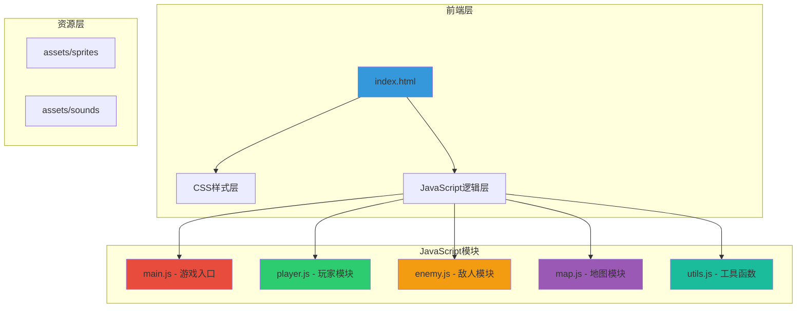
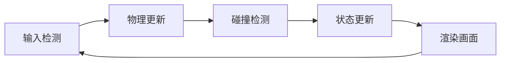

# 像素冒险游戏 - 技术架构文档

## 1. 架构设计



## 2. 技术选型

- **前端技术**：原生 HTML5 + CSS3 + JavaScript ES6+
- **渲染方式**：HTML5 Canvas 2D Context
- **游戏循环**：requestAnimationFrame
- **音效**：Web Audio API
- **文件结构**：模块化ES6（使用type="module"）

## 3. 目录结构

```
pixel-game/
├── index.html              # 主页面
├── css/
│   └── style.css           # 样式（像素化字体、滤镜）
├── js/
│   ├── main.js             # 入口 & 游戏循环
│   ├── player.js           # 玩家逻辑
│   ├── enemy.js            # 敌人逻辑
│   ├── map.js              # 地图/关卡
│   └── utils.js            # 工具函数
└── assets/
    ├── sprites/            # 像素图片（8x8, 16x16, 32x32）
    │   ├── player.png
    │   ├── enemy.png
    │   ├── coin.png
    │   ├── heart.png
    │   └── tile.png
    └── sounds/             # 8-bit音效
        ├── jump.wav
        ├── coin.wav
        ├── hurt.wav
        └── gameover.wav
```

## 4. 模块职责

### 4.1 main.js - 游戏入口
- 初始化Canvas
- 管理游戏状态（menu/playing/paused/gameover）
- 主循环控制
- 场景切换管理

### 4.2 player.js - 玩家模块
- 玩家实体类
- 移动控制（键盘输入）
- 跳跃物理
- 碰撞检测
- 动画状态管理

### 4.3 enemy.js - 敌人模块
- 敌人实体类
- 巡逻AI
- 跳跃敌人AI
- 碰撞检测

### 4.4 map.js - 地图模块
- 平台数据定义
- 物品（金币、道具）生成
- 相机系统（横向卷轴跟随）
- 地图渲染

### 4.5 utils.js - 工具函数
- 碰撞检测函数（矩形相交）
- 音效播放函数
- 图像加载工具
- 坐标转换函数

## 5. 数据结构

### 5.1 玩家状态
```javascript
Player {
    x: number,           // X坐标
    y: number,           // Y坐标
    width: number,       // 宽度（16px）
    height: number,      // 高度（16px）
    velocityX: number,   // X轴速度
    velocityY: number,   // Y轴速度
    isJumping: boolean, // 是否跳跃中
    lives: number,       // 生命值
    score: number,       // 分数
    coins: number        // 金币数
}
```

### 5.2 敌人状态
```javascript
Enemy {
    x: number,
    y: number,
    width: number,
    height: number,
    type: 'patrol' | 'jumping',
    direction: 1 | -1,
    speed: number
}
```

### 5.3 地图配置
```javascript
Map {
    width: number,       // 地图宽度
    height: number,      // 地图高度
    platforms: Array,    // 平台数组
    coins: Array,        // 金币数组
    enemies: Array,      // 敌人数组
    goalPosition: {x, y} // 终点位置
}
```

## 6. 游戏循环



### 6.1 帧率控制
- 目标帧率：60 FPS
- 使用 requestAnimationFrame
- 固定时间步长：16.67ms

## 7. 音效系统

### 7.1 Web Audio API
```javascript
AudioManager {
    context: AudioContext,
    sounds: Map<string, AudioBuffer>,
    play(soundName): void,
    stop(soundName): void
}
```

### 7.2 音效列表
| 音效名称 | 触发条件 | 频率特征 |
|---------|---------|---------|
| jump | 玩家跳跃 | 200Hz→400Hz上升 |
| coin | 收集金币 | 800Hz短促音 |
| hurt | 受到伤害 | 200Hz→100Hz下降 |
| gameover | 游戏结束 | 低沉下行音 |

## 8. 渲染层次

1. 背景层（天空、远景）
2. 平台层（地面、平台）
3. 物品层（金币、道具）
4. 敌人层
5. 玩家层
6. HUD层（分数、生命）
7. UI层（菜单、暂停）

## 9. 性能优化

- Canvas双缓冲渲染
- 对象池复用（金币粒子）
- 视口外对象不渲染
- 合理使用 requestAnimationFrame
